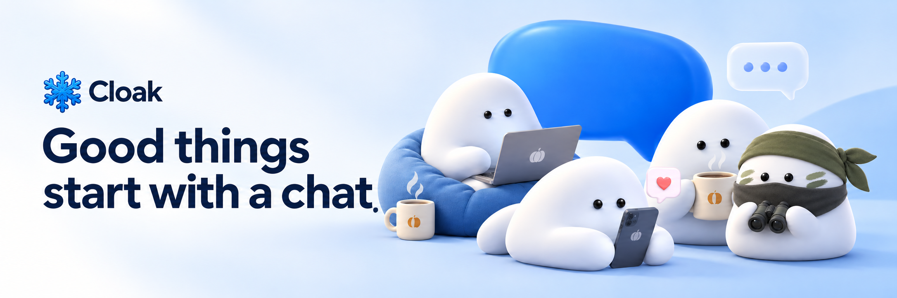
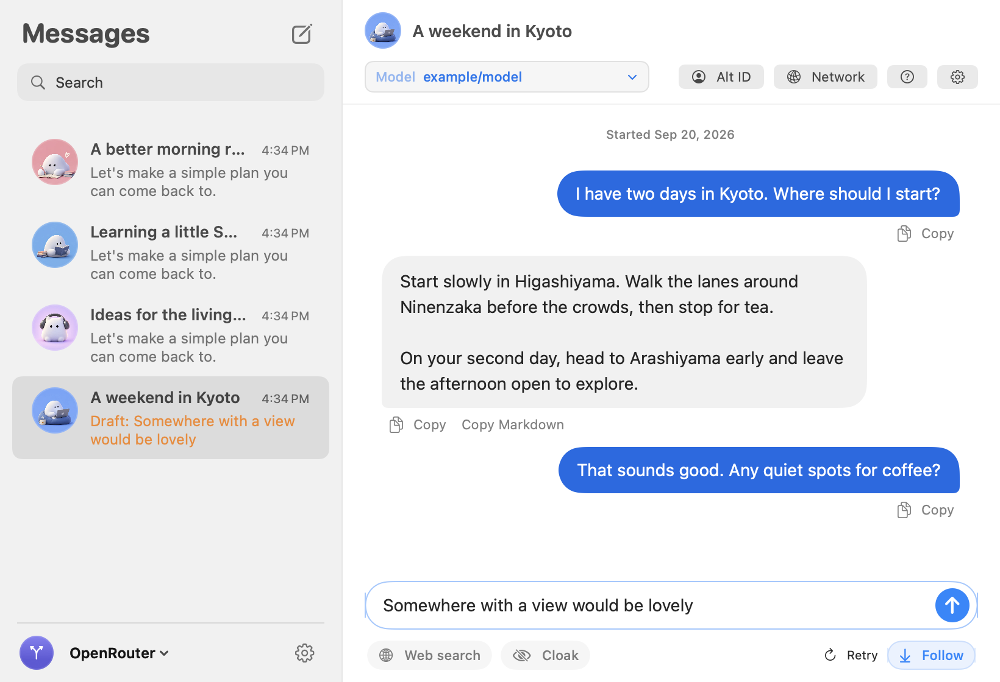
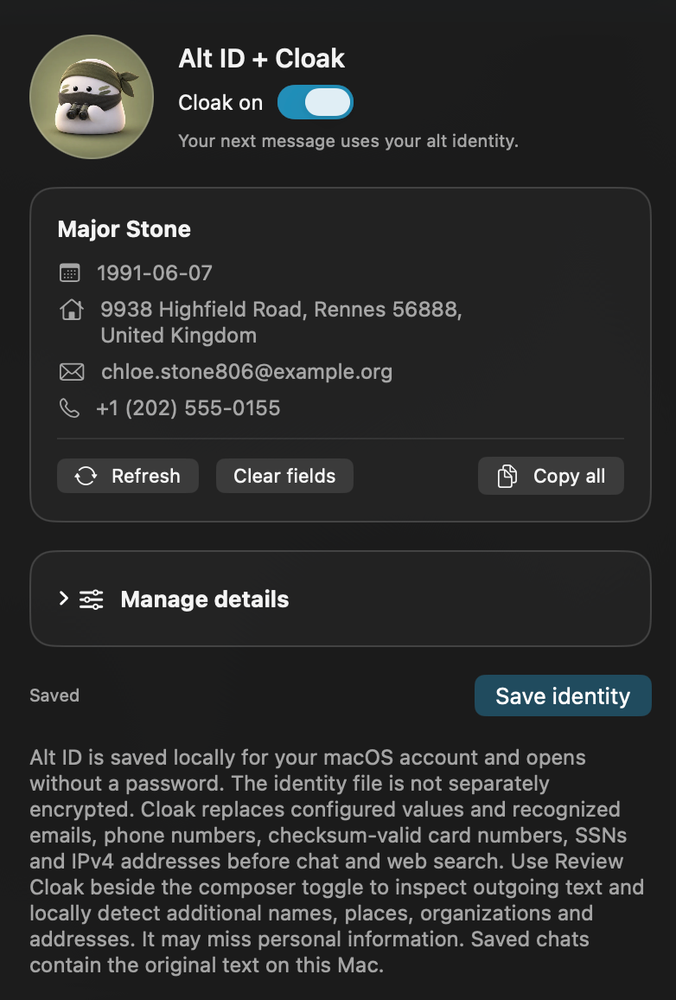
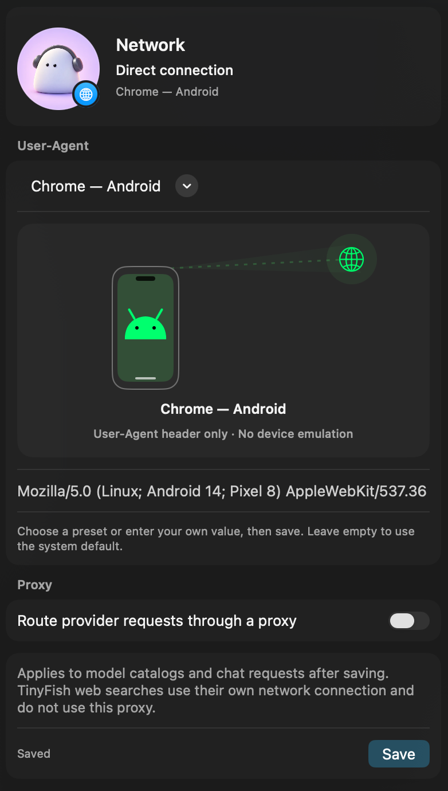

<p align="center">
  <strong>Chat freely. Share only what you choose.</strong><br>
  Cloak swaps your personal details for a realistic stand-in — and reshapes your connection — before anything reaches the AI.
</p>

<p align="center">
  <sub>Native Alt&nbsp;ID&nbsp;+&nbsp;Cloak · User-Agent &amp; HTTP/SOCKS5 obfuscation · macOS · iOS · Android · Windows</sub>
</p>

<p align="center">
  <a href="#cloak-on-share-less"><strong>Meet Cloak</strong></a>
  &nbsp; · &nbsp;
  <a href="#make-the-connection-yours">Network obfuscation</a>
  &nbsp; · &nbsp;
  <a href="#say-hello">Start chatting</a>
  &nbsp; · &nbsp;
  <a href="#build-it-yourself">Build it yourself</a>
</p>

Bring your question — the email, the plan, the first draft — without handing over who you are.

**Cloak is a chat app built privacy-first.** A native **Alt ID** replaces matching names, emails, and other personal details before they’re sent, and restores them in the reply. The built-in **Network** panel lets you present a different User-Agent and route requests through an HTTP or SOCKS5 proxy. Then pick any model from your provider and chat as easily as sending a message — on your Mac, your phone, and your PC.

<picture>
  <source media="(prefers-color-scheme: dark)" srcset="docs/assets/chat-dark.png">
  
</picture>

<p align="center"><sub>Familiar in light and dark. Shown with a sample conversation.</sub></p>

<table>
  <tr>
    <td width="33%" valign="top">
      
      <h3>Your question. Your terms.</h3>
      <p>Meet Cloak. Hide matching names, emails, and other personal details before you send. Preview what leaves your device.</p>
    </td>
    <td width="33%" valign="top">
      
      <h3>Make yourself at home.</h3>
      <p>Familiar bubbles. Favorite conversations. A little face for every chat. Everything right where you expect it.</p>
    </td>
    <td width="33%" valign="top">
      
      <h3>Find your kind of AI.</h3>
      <p>A writing partner. A coding helper. A fresh point of view. Choose your model and change it when you want.</p>
    </td>
  </tr>
</table>

## Cloak on. Share less.

<a href="docs/assets/alt-id-cloak.png">
  
</a>

Get help with the email, the plan, the first draft. Give the names and personal details a little cover.

Save your real and alternate details in **Alt ID**, then turn on **Cloak**. It swaps matching text before it reaches the AI and restores recognized replacements in the reply.

> You write **“I’m Maya.”** The AI sees **“I’m Alex.”**
>
> When it says **“Hi Alex,”** you see **“Hi Maya.”**

**See it before you send it.** Open **Review Cloak** to check the outgoing text, hide extra details, and send when it looks right. The review’s suggestions are found on your device.

Your Cloak replacements apply to web searches, too.

Cloak can miss details. Review sensitive text before sending. Your saved chats keep the originals.

<br clear="all">

## Make the connection yours.

<a href="docs/assets/network-panel.png">
  
</a>

Cloak isn’t only about the words you send. Open the **Network** panel to present a different **User-Agent** — pick a preset for Chrome, Safari, an iPhone or Android, or type your own — and route provider requests through an **HTTP or SOCKS5 proxy**.

It applies to your model catalogs and chat requests alike, so what reaches the provider looks the way you want it to. Obfuscation is built in, not bolted on.

<br clear="all">

## Keep the good conversations going.

Pick up yesterday’s idea. Start something new. Your chats save on your device, ready when you come back.

Watch replies arrive. Stop anytime. Try another answer. Copy the bit you need and get on with your day.

**OrcaRouter · OpenRouter · Featherless · Concurred**

Your choice of provider. Your choice of model. One place to chat.

## A few thoughtful extras.

**Bring the web along.** Add search results to your question when you need more context — with your Cloak replacements applied to the query. Web search uses a separately installed TinyFish tool (desktop).

**Keep the familiar comforts.** Keys in your system keystore by default, with a local-file option for no prompts. Chat history on your device. Alt ID opens without a password.

## Say hello.

**macOS 14+ · iOS · Android · Windows · Your own provider API key**

1. Get Cloak from the [latest release](https://github.com/harshsaver/Cloak/releases/latest), or build it from source (below).
2. Add your API key in **Settings**.
3. Choose a provider and model. Send your first message.

Want to share less from the start? Save your details in **Alt ID** and switch on **Cloak** before sending.

Model access and charges come from your provider.

## Build it yourself

Cloak is a [Flutter](https://flutter.dev) app.

```bash
git clone https://github.com/harshsaver/Cloak.git
cd Cloak
flutter pub get

# Run on your platform of choice
flutter run -d macos      # or: windows, chrome, <device-id>

# Build a release
flutter build macos       # or: apk, ipa, windows
```

Run the tests with `flutter test`.

<p align="center">
  <strong>Something on your mind?</strong><br>
  <a href="https://github.com/harshsaver/Cloak/issues">Tell us what would make Cloak better.</a>
</p>
